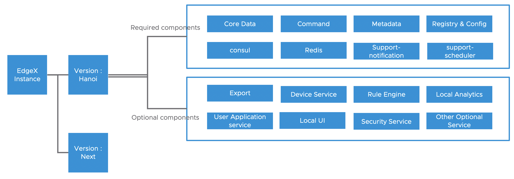
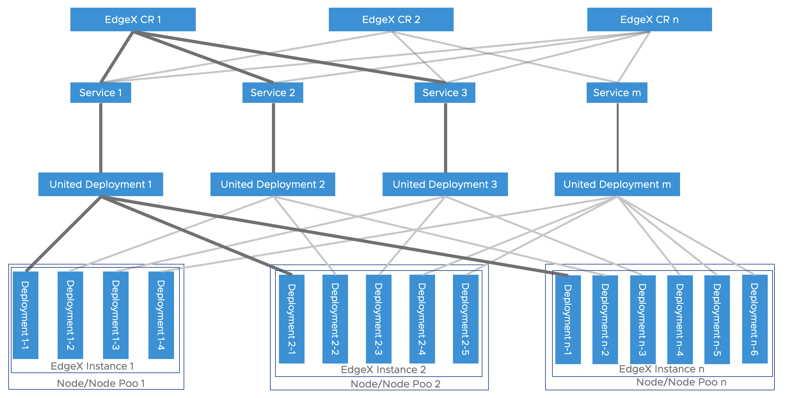

# Yurt-edgex-manager

**IMPORTANT: yurt-edgex-manager has been merged into the openyurt repo, so project is no longer being actively maintained and has been archived.**

## Archived Project

This project has been archived and is no longer being actively maintained. This means you can view and copy the code, but cannot make changes or propose pull requests.

While you're here, feel free to review the code and learn from it. If you wish to use the code or revive the project, you can fork it to your own GitHub account.

 

## ✨ What is yurt-edgex-manager

Yurt-edgex-manager is an OpenYurt component for EdgeX management.
User now can install, upgrade, delete EdgeX in OpenYurt cluster by just manipulating EdgeX CR.

For details of the design, please see the [device-management](https://github.com/openyurtio/openyurt/blob/master/docs/proposals/20210310-edge-device-management.md) and
[edgex-integration](https://github.com/openyurtio/openyurt/blob/master/docs/proposals/202106120-edgex-integration.md)

## 📣 Getting Started

The yurt-edgex-manager is design to work with yurt-device-controller, the whole documentation can be found there
[OpenYurt Tutorials](https://openyurt.io/docs/next/)

For people who want to develop and test yurt-edgex-manager alone can check [Getting start](Documentation/getting_start.md).

## 🛩️ Contributing

Contributions are welcome, whether by creating new issues or pull requests. See
our [contributing document](https://github.com/openyurtio/openyurt/blob/master/CONTRIBUTING.md) to get started.

## ✉️ Contact

- Mailing List: openyurt@googlegroups.com
- Slack: [channel](https://join.slack.com/t/openyurt/shared_invite/zt-iw2lvjzm-MxLcBHWm01y1t2fiTD15Gw)
- Dingtalk Group (钉钉讨论群)

    

## 📃 License
Yurt-edgex-manager is under the Apache 2.0 license. See the [LICENSE](LICENSE) file
for details.
